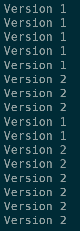

# Simple blue green
The goal of this section is to build a GitHub Actions pipeline that willcreate a simple blue-green deployment of your application.

Before you start, delete the previous helm chart that was deployed using GH actions in step 3. You can execute this in cloud shell in the Azure portal
```
az aks get-credentials -n <clustername> -g <cluster-rg>
helm delete website
```

# Introduction
If you used the show-version script in step 3, you might have noticed that as updates happened, you got a mixed set of returns back, as shown in the picture below:



This happens because Kubernetes by default does a rolling upgrade when upgrading a deployment to new version. 

There are other deployment strategies, the most popular being blue/green and canary deployments. 

In this section you will use a very rudementary blue/green deployment. You will use the labe selector on the Kubernetes Deployment to point traffic either the blue or green deployment. As you're updating the application you'll update the 'non-production' deployment and only after the update push the updates.

Optionally, after this is done, you can also use the environments feature in GitHub actions to allow manual approvals to trigger the update.

Let's start by exploring the blue-green helm chart that was prebuilt for you, and how you can update the application.

## Exploring the helm chart
The helm chart for this example contains the following objects:
- deployment.blue
- deployment.green
- serviceprod

You influence the values of these objects using either the values.yaml file or by using ```--set``` feature of the helm command line tool.

In terms of workflow for updating the version, you'll execute the following steps (in the pipeline):
- Get which deployment is currently in prod (using kubectl get svc on the production service)
- Update the non-production deployment
- Wait for deployment to finish
- When deployment is finished flip the service to the updated deployment

Let's start building this.

# Building the pipeline
You'll build a new pipeline for this action. The beginning of the pipeline (the CI step) will be exactly the same as you used in the previous example:

```yaml
# This is a basic workflow to help you get started with Actions

name: Excersize 3, build container and update

# Controls when the action will run. 
on:
  # Triggers the workflow on push or pull request events but only for the main branch
  push:
    branches: [ main ]
    paths: 
    - 4. Simple blue green/**
    - .github/workflows/4_blue_green.yaml

  # Allows you to run this workflow manually from the Actions tab
  workflow_dispatch:
# Env to set reusable variables
env:
  ACRNAME: nfacr
  
jobs:
  CI:
    # The type of runner that the job will run on
    runs-on: ubuntu-latest
    
    # Steps represent a sequence of tasks that will be executed as part of the job
    steps:
      # Checks-out your repository under $GITHUB_WORKSPACE, so your job can access it
      - name: Git checkout
        uses: actions/checkout@v2

      - name: az CLI login
        uses: azure/login@v1
        with:
          creds: ${{ secrets.AZURE_CREDENTIALS }}
      
      - name: ACR login
        run: az acr login -n $ACRNAME
        
      
      - name: Build and push image
        uses: docker/build-push-action@v2
        with:
          context: "./3. Build container and push to ACR"
          push: true
          tags: ${{ env.ACRNAME }}.azurecr.io/microhack/website:${{ github.run_number }}
          
```

## needed
Need to figure out blue/green logic
1. update labels on deployment to include blue and green
2. update pipeline to do:
    1. get current prod (blue or green)
    2. update the non-prod
    3. manual approval in github actions
    4. flip blue and green to production
3. maybe we include a small script to run locally, that gets the current website and build a graph (how easy is this???) of what is returned as a value
--> that sames script from the previous step, can now gracefully show a full atomic switch from blue to green


dockerfile
html
need to do az aks update --attach-acr (or we include this in the prerequisites??? maybe???)
helm chart
    variables in helm --> one of those will be image + tag
pipeline.yaml --> run the action
    1. Login to Azure
    2. login to ACR
    3. build image (tag - use either the github action runner version OR the SHA HASH from GIT)
    4. push image to registry
    2. Get kubernetes credentials
    3. Update the deployment using helm --> --set tag=updated version (for example)
    4. Test the pipeline
    5. Put a trigger filter on the pipeline, so it only get triggered when changes to directory 1. or the deployment.yaml get made